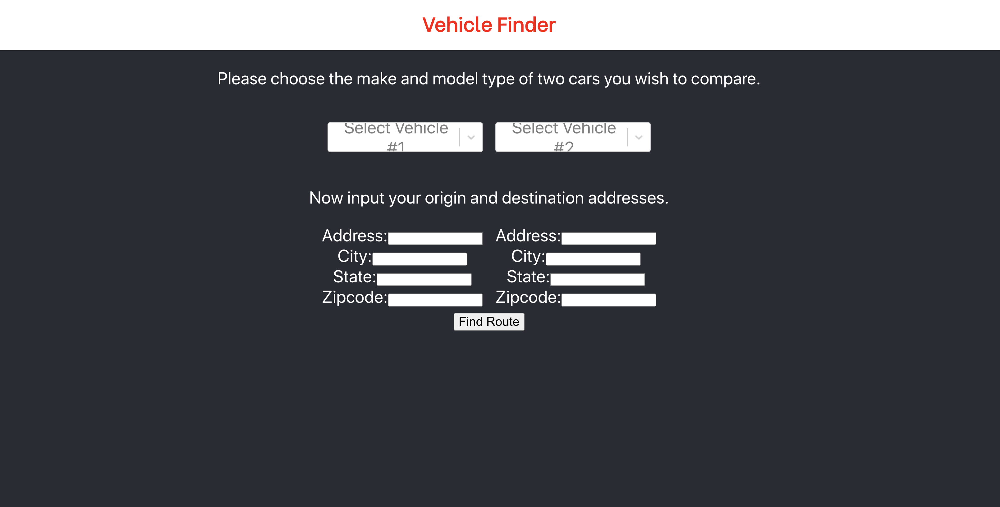

#EVgas

<!-- TABLE OF CONTENTS -->
## Table of Contents

* [About the Project](#about-the-project)
  * [Created With](#created-with)
* [Getting Started](#getting-started)
  * [Prerequisites](#prerequisites)
  * [Installation](#installation)
* [Usage](#usage)
* [Team Members](#team-members)
* [Acknowledgements](#acknowledgements)


<!-- ABOUT THE PROJECT -->
## About The Project

Our project started off as an idea of whether an electric car has a lower carbon footprint compared to that of a gasoline-powered car. 
We had heard previously that in states where the main source of energy is non-renewable resources, like coal and oil, 
that electric cars had larger carbon footprints than their gasoline-powered car counterparts. 
Thus, the main goal of this project was to create a web app that allowed users to determine 
if it is more beneficial to drive a gas-powered or electric car on a given route in the United States. 

For this web app, we built it from scratch utilizing the Google maps and various government agencies API. We first calculated 
the distance between two points, and then we calculated points along the route where the car would need to stop and refuel or charge
up. For gas cars, we calculated the total miles traveled and multiplied it by the grams of carbon emitted per each mile to find the
carbon footprint. For electric cars, at each stop, we found the carbon footprint of the energy source in that given region. In other words,
if an electric car stopped to refuel in a state that relies on non-renewable energy sources, like coal and oil, the electric car would have
a larger footprint than stopping in a state that relies on renewable energy sources, like hydroelectric and wind power. We then 
display the total carbon footprint in grams of the given cars and determine which one has a lower carbon footprint. We display this result
on the web app.   


### Created With
* [React](https://reactjs.org/)
* [Node.js](https://nodejs.org/en/)
* [Google Cloud](https://cloud.google.com/)


<!-- GETTING STARTED -->
## Getting Started

This is an example of how you may give instructions on setting up your project locally.
To get a local copy up and running follow these simple example steps.

### Prerequisites

This is an example of how to list things you need to use the software and how to install them.
* npm
```sh
npm install npm@latest -g
```

### Installation

1. Get a free API Key at [https://example.com](https://example.com)
2. Clone the repo
```sh
git clone https://github.com/your_username_/Project-Name.git
```
3. Install NPM packages
```sh
npm install
```
4. Enter your API in `config.js`
```JS
const API_KEY = 'ENTER YOUR API';
```


<!-- USAGE EXAMPLES -->
## Usage


This is what the front end website looks like while in development. 


<!-- Team Members -->
## Team Members

* Gaurav Gowda
    * https://www.linkedin.com/in/gaurav-gowda-341322154/

* Hitesh Boinpally
    * https://www.linkedin.com/in/hitesh-boinpally/

* Aditya Balasubramanian 
    * https://www.linkedin.com/in/aditya-balasubramanian4848/


<!-- ACKNOWLEDGEMENTS -->
## Acknowledgements
We would like to thank John Hopkins University, and the organizing team at HopHacks for the opportunity to compete
at this hackathon. We all had a lot of fun and learned so much!


